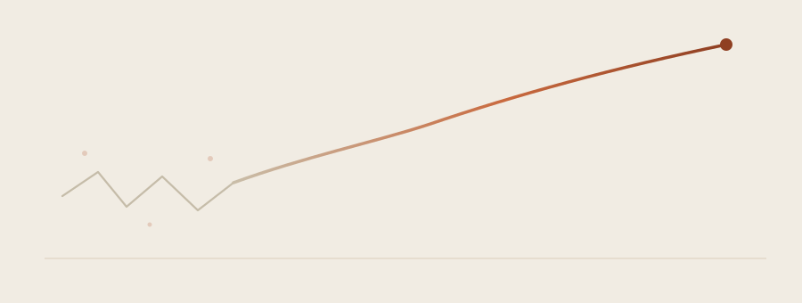

I didn't set out with a straight line to "Data Scientist." It started with a CS degree and a specialization in data science that I picked almost on instinct, followed by an internship at C-DOT where I built a deep-learning face recognition system and, in the same stretch, a multimodal dashboard for disaster response. Around the same time I was pulling together ontology graphs in Neo4j for a missile classification NLP project — two problems that had almost nothing in common except that both rewarded patience with messy data.

Joining Fractal Analytics as a Data Scientist in September 2024 changed the shape of the work more than the substance of it. I went from single models solving one problem to systems: RAG pipelines that need to retrieve the right document out of thousands, agentic workflows that have to decide *which* tool to call and *when*, and vision-language models that have to read a scanned PDF as reliably as a person would. The common thread across BHP's safety analytics, Carrier's order automation, and Molina's agentic claims processing has been the same lesson repeated in different clothes: the model is rarely the hard part, the pipeline around it is.

What surprised me most is how much of this work is still craft rather than formula — deciding where to put a human checkpoint, how much context an agent actually needs, when a smaller fine-tuned model beats a bigger general one. I'm building this site partly to keep a record of that craft as it develops, and partly because writing things down is still the fastest way I know to find out whether I actually understand them.
